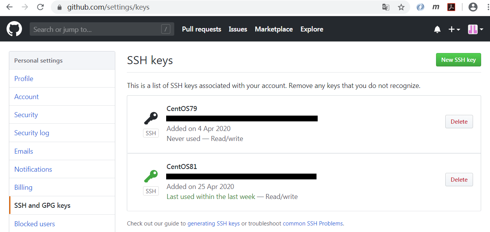
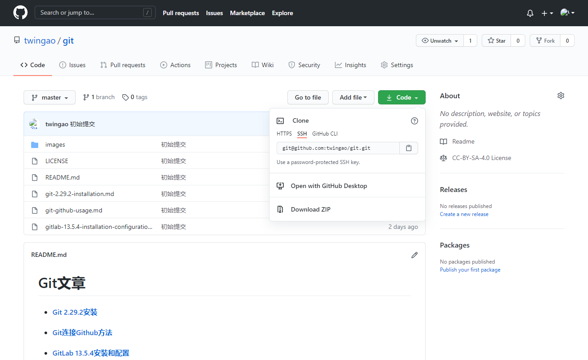
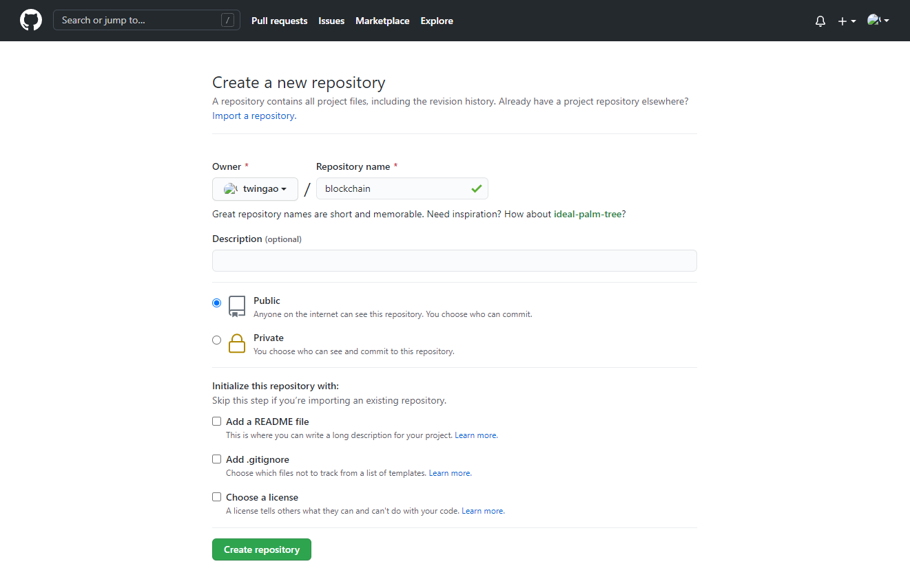
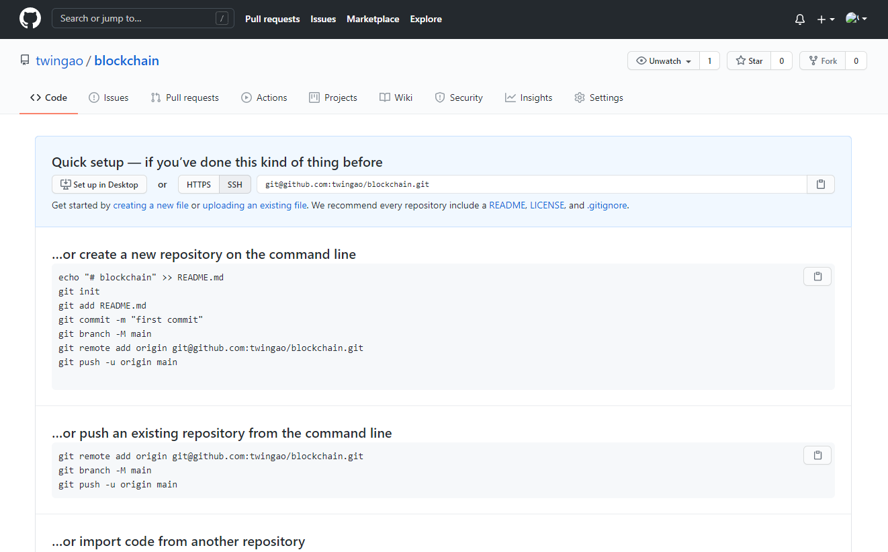

# CentOS下Git连接Github方法

## 安装Git

共有三种安装方式。

### Yum安装Git 1.8.3.1版本

安装git。

    yum install -y git
    
    git --version
    git version 1.8.3.1

### Yum安装Git 2.x版本

    curl https://setup.ius.io -s | sh

    yum search git

    yum install -y git224

    git --version
    git version 2.24.3

### 通过安装包安装Git 

参见[Git 2.29.2 安装](git-2.29.2-installation.md)。

## 配置GitHub

全局化变量的配置。

    git config --global user.name "xxxxxx"
    git config --global user.email "xxxxxx@sina.cn"

GitHub可以采用SSH和HTTPS连接，通常使用SSH连接方式安全和简单一些。生成SSH key。一路回车，选择缺省值。

    ssh-keygen -t rsa -C "xxxxxxx@sina.cn"

公钥存放在`/root/.ssh/id_rsa.pub`文件中。

    cat /root/.ssh/id_rsa.pub
    ssh-rsa AAAAB3NzaC1yc2EAAAADAQABAAABAQC4OiKJsdh895TmJT0a7JUdAkzN3fcgfZvx6yH4cL23tEIdFCffWnze89qp61pAeYjMehQML5hY9pc7PSpUmm90FBgiBK00A3PN1XIxvWwmJ22ZS+3tdwcgX245Iky0E+UVbYQaTw4+0TB90CZQtIjzwnQkq6bU5RRlLr41f/GlR/XIH7Luu+13H0BCtnX/x7WoAzB2hF5XZaV5MFG661mPSL2OZQ52CV63ZSxQCKhcqFPtpzp01kz7t8bwjn+bIUmX7tfXU3XAnwLERlRtmR4y1vCufuCzreqBQXJLQspGQ/mH0u3fxmzt0/EW5AlJ3X9S1wEBOb/TzbwKlCoeQ6od xxxxxx@sina.cn

需要将公钥配置到GitHub中。请先注册一个GitHub账号，然后到settings -> SSH and GPG keys将公钥配置进去。

可以检测是否能通过SSH连接到GitHub。如果出现以下信息表示可以连接。

    ssh -T git@github.com
    The authenticity of host 'github.com (192.30.255.112)' can't be established.
    RSA key fingerprint is SHA256:nThbg6kXUpJWGl44fgrjepRomTxdCARLviKw6E5SY8.
    RSA key fingerprint is MD5:16:27:ac:a5:76:28:2d:38:63:1b:56:4d:eb:af:a6:48.
    Are you sure you want to continue connecting (yes/no)? yes
    Warning: Permanently added the RSA host key for IP address '192.30.255.113' to the list of known hosts.
    Hi twingao! You've successfully authenticated, but GitHub does not provide shell access.

## 克隆仓库

通过SSH连接克隆一个仓库，仓库的SSH地址如下图。

    git clone git@github.com:twingao/git.git
    正克隆到 'git'...
    remote: Enumerating objects: 16, done.
    remote: Counting objects: 100% (16/16), done.
    remote: Compressing objects: 100% (16/16), done.
    remote: Total 16 (delta 0), reused 16 (delta 0), pack-reused 0
    接收对象中: 100% (16/16), 381.70 KiB | 15.00 KiB/s, 完成.

可以看出已经克隆仓库。

    ls
    git

## 上传仓库

在克隆后修改了文件，将修改后的文件推送到GitHub中。

    git add .
    git commit -m "增加了：Windows下Git连接Github方法"
    git push -u origin master

## 初始化并上传仓库

假设在本地已经有相关的项目文件，需要上传到GitHub中。可以先在GitHub中创建新的仓库。

然后在本地将项目文件推送到GitHub仓库中。

    cd blockchain
    git init
    git add .
    git commit -m "first commit"
    git remote add origin git@github.com:twingao/blockchain.git
    git push origin master

后续修改了文件，仍然可以向上一节一样上传仓库。