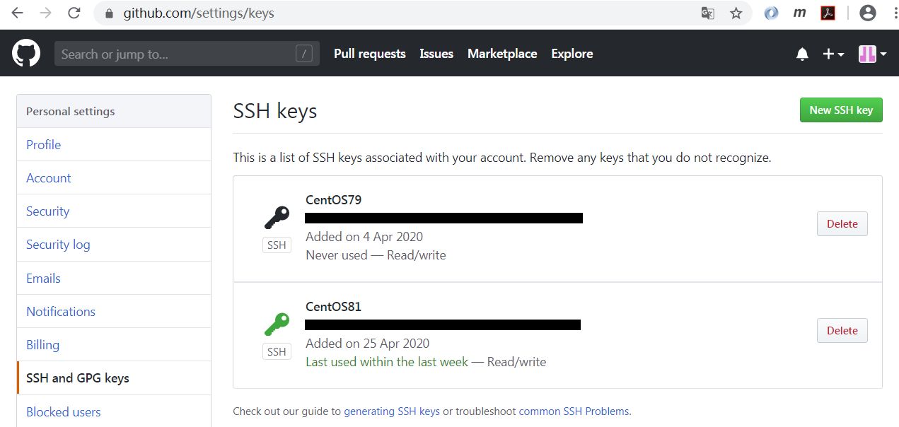

# Git连接Github方法

安装git。

    yum install -y git
    
    git version
    git version 1.8.3.1

全局化变量的配置。

    git config --global user.email "xxxxxx@sina.cn"
    git config --global user.name "xxxxxx"

github可以采用SSH和https连接，可以检测是否能通过ssh连接到github。如果出现以下信息表示可以连接。

    ssh -T git@github.com
    The authenticity of host 'github.com (52.74.223.119)' can't be established.
    RSA key fingerprint is SHA256:nThbg6kXUpJWGl7E1IGOCspRomTxdCARLviKw6E5SY8.
    RSA key fingerprint is MD5:16:27:ac:a5:76:28:2d:36:63:1b:56:4d:eb:df:a6:48.
    Are you sure you want to continue connecting (yes/no)? ^C

生成ssh key。一路回车，选择缺省值。

    ssh-keygen -t rsa -C "xxxxxxx@sina.cn"

公钥存放在`/root/.ssh/id_rsa.pub`文件中，需要将公钥配置到github中。请先注册一个github账号，然后到settings -> SSH and GPG keys将公钥配置进去。

通过ssh连接克隆一个仓库，仓库的ssh地址如下图。

    git clone git@github.com:grpc/grpc-go.git grpc-go
    正克隆到 'grpc-go'...
    The authenticity of host 'github.com (13.250.177.223)' can't be established.
    RSA key fingerprint is SHA256:nThbg6kXUpJWGl7E1IGOCspRomTxdCARLviKw6E5SY8.
    RSA key fingerprint is MD5:16:27:ac:a5:76:28:2d:36:63:1b:56:4d:eb:df:a6:48.
    Are you sure you want to continue connecting (yes/no)? yes
    Warning: Permanently added 'github.com,13.250.177.223' (RSA) to the list of known hosts.
    remote: Enumerating objects: 83, done.
    remote: Counting objects: 100% (83/83), done.
    remote: Compressing objects: 100% (66/66), done.
    remote: Total 19673 (delta 23), reused 32 (delta 11), pack-reused 19590
    接收对象中: 100% (19673/19673), 10.38 MiB | 52.00 KiB/s, done.
    处理 delta 中: 100% (12195/12195), done.
