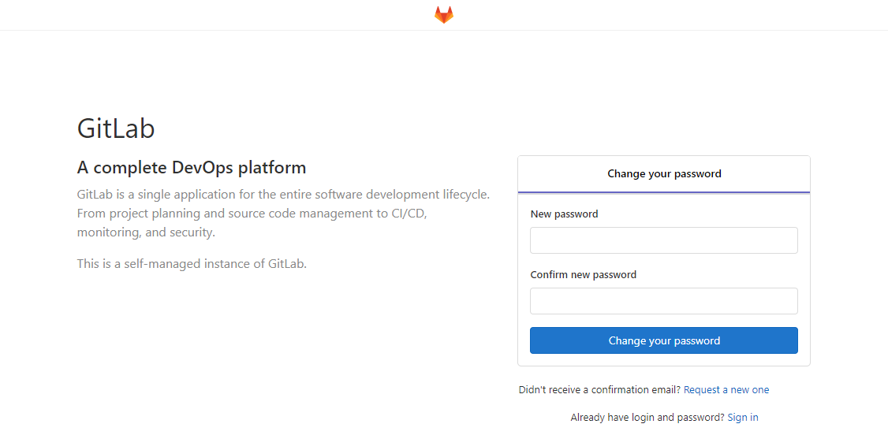
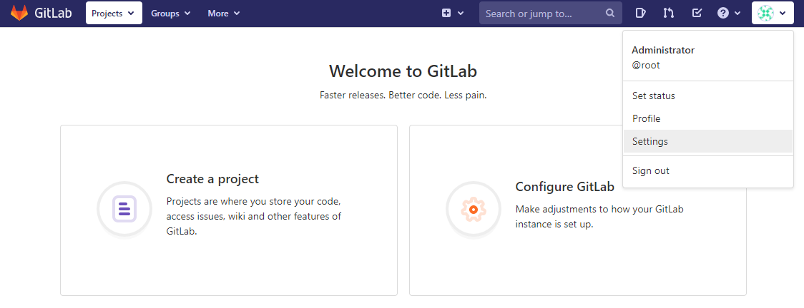
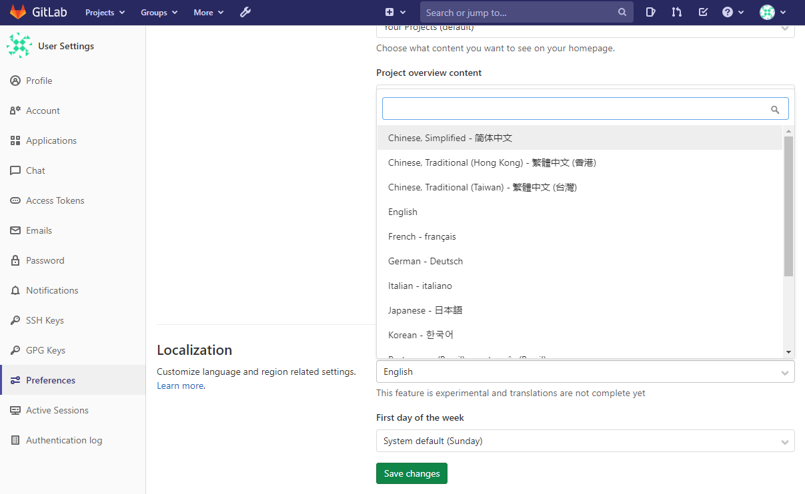
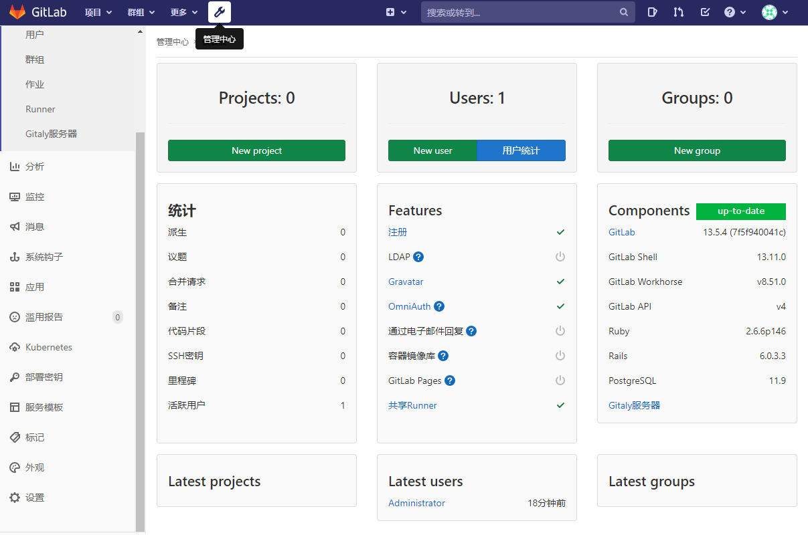
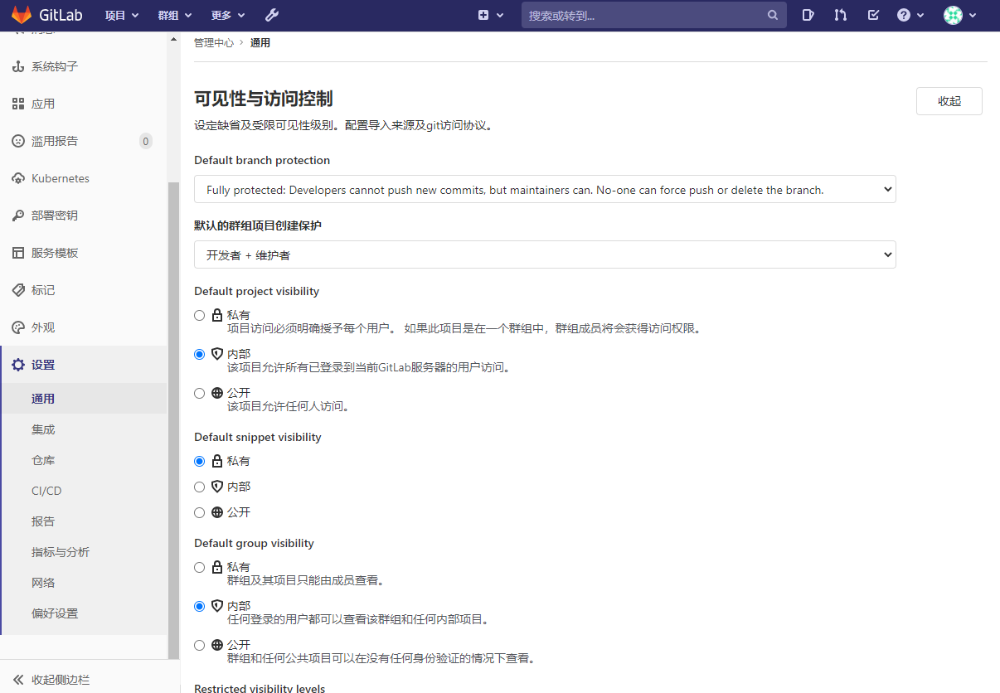
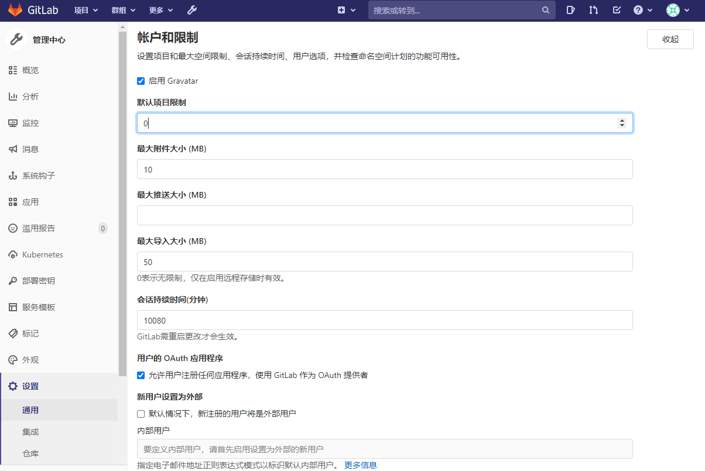

# GitLab 13.5.4安装和配置

## 环境

| IP地址 | 主机名| 操作系统 |
| :- | :- | :- |
| 192.168.2.70 | gitlab | CentOS Linux 7.8.2003 |

## GitLab安装

yum源配置

    vi /etc/yum.repos.d/gitlab-ce.repo
    [gitlab-ce]
    name=Gitlab CE Repository
    baseurl=https://mirrors.tuna.tsinghua.edu.cn/gitlab-ce/yum/el$releasever/
    gpgcheck=0
    enabled=1

更新本地yum缓存

    yum makecache

查找gitlab-ce版本。

    yum list gitlab-ce --showduplicates | sort -r

安装最新版本gitlab-ce。

    yum install -y gitlab-ce-13.5.4-ce.0.el7

## GitLab配置

修改一下GitLab的配置。

    vi /etc/gitlab/gitlab.rb

    # 外部访问url。
    external_url 'http://gitlab.twingao.com'

    # 用户缺省不能创建群组。
    gitlab_rails['gitlab_default_can_create_group'] = false

    gitlab_rails['ldap_enabled'] = true
    # gitlab_rails['prevent_ldap_sign_in'] = false

    # LDAP配置
    ###! **remember to close this block with 'EOS' below**
      gitlab_rails['ldap_servers'] = YAML.load <<-'EOS'
        main: # 'main' is the GitLab 'provider ID' of this LDAP server
          label: 'LDAP'
          host: '192.168.2.52'
          port: 389
          uid: 'sAMAccountName'
          bind_dn: 'CN=twingao, OU=allusers, DC=ad, DC=depeac, DC=com'
          password: 'Admin123'
          encryption: 'plain' # "start_tls" or "simple_tls" or "plain"
          verify_certificates: true
          smartcard_auth: false
          active_directory: true
          allow_username_or_email_login: true
          lowercase_usernames: false
          block_auto_created_users: false
          base: 'OU=allusers, DC=ad, DC=depeac, DC=com'
          user_filter: ''
          ## EE only
    #     group_base: ''
    #     admin_group: ''
    #     sync_ssh_keys: false
    #
    #   secondary: # 'secondary' is the GitLab 'provider ID' of second LDAP server
    #     label: 'LDAP'
    #     host: '_your_ldap_server'
    #     port: 389
    #     uid: 'sAMAccountName'
    #     bind_dn: '_the_full_dn_of_the_user_you_will_bind_with'
    #     password: '_the_password_of_the_bind_user'
    #     encryption: 'plain' # "start_tls" or "simple_tls" or "plain"
    #     verify_certificates: true
    #     smartcard_auth: false
    #     active_directory: true
    #     allow_username_or_email_login: false
    #     lowercase_usernames: false
    #     block_auto_created_users: false
    #     base: ''
    #     user_filter: ''
    #     ## EE only
    #     group_base: ''
    #     admin_group: ''
    #     sync_ssh_keys: false
    EOS

gitalb-ctl gitlab:ldap:check

gitalb-ctl restart

配置生效。

    gitlab-ctl reconfigure

在C:\Windows\System32\drivers\etc\hosts文件中增加域名。

    192.168.2.70 gitlab.twingao.com

访问[http://gitlab.twingao.com/](http://gitlab.twingao.com/)。系统预置管理员账号root，第一次登陆需要修改root的密码。

以下修改一些常用配置。

### 简体中文

将界面修改为简体中文，修改后刷新一下页面。

点击左上角的管理中心。

### 工程和群组可见性

在[配置]-->[通用]-->[可见性与访问控制]中将工程和群组的改为“内部”，表示GitLab内部账号都能看到。

### 用户缺省不能创建工程

在[配置]-->[通用]-->[帐户和限制]中将“默认项目限制”改为0，这样用户缺省是无法创建工程的。

